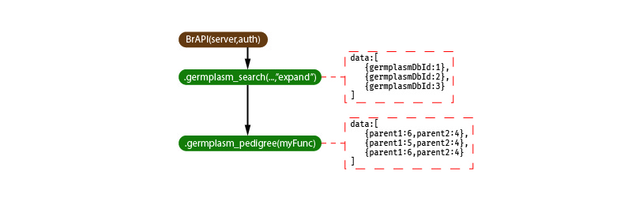

# BrAPI.js

BrAPI.js is a JavaScript client library for [BrAPI](https://brapi.org). It can be used either in the browser or within Node.js. It uses the [Fetch API](https://developer.mozilla.org/en-US/docs/Web/API/Fetch_API) (or [node-fetch]() in Node.js) for AJAX calls. BrAPI.js also uses ES6 classes.

### To-Do
- Fail gracefully after failed AJAX calls

## Build:
```bash
git clone https://github.com/solgenomics/BrAPI.js.git
cd BrAPI.js
# Be sure your version of NPM supports 'prepare' scripts (>=npm@4.0.0)
npm install . 
```

## Include/Require:
```html
<!--Browser-->
<script src="build/BrAPI.js" charset="utf-8"></script>
```
```js
// ES6 import
import BrAPI from './build/BrAPI.js';
```
```js
// Node.js
const BrAPI = require('BrAPI.js');
```

## How it Works / Terminology
BrAPI.js tames REST callback-hell by managing asynchronosity behind context managers (from here on, nodes). Nodes keep track of sets of BrAPI responses (data) and are arranged in a DAG in which edges represent two differnt types of callback hooks, "async" (executed once each datum) and "final" (executed once all calls in the current context node have completed and across the all data from that node).

## Usage
<a name="brapi" href="#brapi">#</a> **BrAPI**(_address_ [, _auth_params_]) [<>](main.js "Source")  
Creates a root _brapi_ (context node) object. This is the root of the BrAPI.js dataflow. The _address_ should be a string with the base URL of the BrAPI instance that is being queried, i.e. "https://www.yambase.org/brapi/v1". If an _auth_params_ object is provided, an authentication call will be made with the provided keys in the call body.  
###### Examples:
```js
var brapi_root = BrAPI("https://www.yambase.org/brapi/v1")
```
```js
var brapi_root = BrAPI(
    "https://www.yambase.org/brapi/v1",
    {
        'username':'myusername',
        'password':'mysecretpw'
    }
)
```

<a name="brapi_call" href="#brapi_call">#</a> _brapi_.**{ _brapi_call_ }**(_params_ [, _behavior_]) [<>](src/brapi_methods.js "Source")  
Creates a new _brapi_ context node and sets its data to the result of the specified BrAPI call. The _brapi_call_ should be one of the [availible BrAPI methods](#brapi_methods). Parameters (both URL and body) are specified for the call using the _params_ arguement. The _params_ arguement can either be an object, or a function. If it is a function, a seperate BrAPI call will be made for each datum of the previous node. There are two special parameters specific to BrAPI.js. The first, `pageRange` (an array [first_page,last_page]) must be used for controlling pagination instead of the BrAPI `page` parameter it defaults to `[0,Infinity]`. `PageSize` sets the page size as it does in a raw BrAPI call. The second, `HTTPMethod` allows one to overide the default HTTP method (e.g. "post","get") for a BrAPI call. For calls which return a paginated response (i.e. _brapi_.**attributes**()), the _behavior_ argument determines how that data is handled. If _behavior_ is undefined or `"expand"`, each object in `brapi_response.results.data` will be treated as individual datum. If _behavior_ is `"map"` the `brapi_response.results.data` array from each response will be concatenated into the initial response's data array and the  resulting `brapi_response.results` object will be considered a single datum. Calls which return a non-paginated response always act with the `"map"` behavior. For each datum created, the full response from which it was extracted is availble via `datum.__response`.
###### Examples:
```js
var germplasm_expanded = brapi_root.germplasm_search({germplasmSpecies:["vinifera"]});
```

```js
var germplasm = brapi_root.germplasm_search({germplasmSpecies:["vinifera"]},"map");
```

```js
var germplasm_expanded = brapi_root.germplasm_search({germplasmSpecies:["vinifera"]});
var pedigrees = germplasm_expanded.germplasm_pedigree(function(datum){
    return {germplasmDbId:datum.germplasmDbId}
});
```


<a name="each" href="#each">#</a> _brapi_.**each**(_func_) [<>](src/Context_Nodes.js "Source")  
Calls _func_(_datum_) for **each** datum after it becomes availble (i.e. once the relevant AJAX call completes).

<a name="all" href="#all">#</a> _brapi_.**all**(_func_) [<>](src/Context_Nodes.js "Source")  
Calls _func_(_data_) after **all** data has become availble, where _data_ is an array of all data for this node. 


## Examples
```js
var germ = BrAPI(
    "http://127.0.0.1:3000/brapi/v1",
    {
        'username':'myusername',
        'password':'mysecretpw'
    }
).germplasm_search({germplasmName:"40"});
var markerprofiles = germ.germplasm_markerprofiles(function(g){
    return {germplasmDbId:g.germplasmDbId};
});

var pedigree = germ.germplasm_pedigree(function(g){
    return {germplasmDbId:g.germplasmDbId};
});

var merge = pedigree.merge(markerprofiles)
    .each(function(pair,index){
        console.log("paired",index,{pdgree:pair[0],mkrpfl:pair[1]})
    });
```

## Available BrAPI Methods <a name="brapi_methods"></a>
| Method Name                            | BrAPI Call               |
| -------------------------------------- | ------------------------ |
| _brapi_.**attributes**(...)            | `/attributes`            |
| _brapi_.**attributes_categories**(...) | `/attributes/categories` |
| ...                                    | ..                       | 
